# 🚀 Flutter Starter Kit

A professional-grade, scalable, and modular Flutter starter kit designed for rapid application development. This project follows a clean architecture pattern with **Bloc/Cubit** for state management and **GoRouter** for navigation.

## 🌟 Key Features

- **State Management:** Powered by `flutter_bloc` (Cubit).
- **Navigation:** Deep linking and route management using `go_router`.
- **Networking:** Robust HTTP client using `dio` with interceptors and custom logging.
- **Design System:** 
  - Comprehensive custom themes (Dark & Light).
  - Reusable UI components (Buttons, TextFields, AppBars).
  - Responsive layouts (Grid, List).
  - Shimmer effects and Lottie animations.
- **Authentication:** Integrated Google Sign-In and local authentication flows.
- **Utilities:** 
  - Centralized validators, formatters, and helpers.
  - Custom exception handling for Firebase and Platform errors.
  - Device and network management.

---

## 📂 Project Structure (lib)

Below is the detailed visualization of the `lib` directory structure, showing the separation of concerns and modularity.

```mermaid
graph TD
    %% Root Level
    Lib[lib]
    
    %% Main Branches
    Lib --> APIS[apis]
    Lib --> Common[common]
    Lib --> Feature[feature]
    Lib --> Router[router]
    Lib --> Utils[utils]
    Lib --> MainFile[main.dart]

    %% APIS Detail
    APIS --> DioHelper[dio_helper.dart]

    %% Common Widgets Detail
    Common --> Appbar[appbar]
    Common --> Buttons[buttons]
    Common --> Images[images]
    Common --> Layouts[layouts]
    Common --> Shimmer[shimmer]
    Common --> Snackbars[snackbars]
    Common --> TextFields[text_fields]

    %% Feature Module Detail
    Feature --> Auth[auth]
    Feature --> Badges[badges_milestones]
    Feature --> Dash[dashboard]

    %% Sub-Feature Structure (Typical)
    Auth --> AuthData[data]
    Auth --> AuthLogic[logic]
    Auth --> AuthPres[presentation]
    
    AuthPres --> AuthLogin[login]
    AuthPres --> AuthSignup[signup]
    AuthPres --> AuthForgot[forgot_password]
    AuthPres --> AuthOTP[otp_verify]

    Badges --> BadgesData[data]
    Badges --> BadgesLogic[logic]
    Badges --> BadgesPres[presentation]

    Dash --> DashData[data]
    Dash --> DashLogic[logic]
    Dash --> DashPres[presentation]

    %% Router Detail
    Router --> AppRouter[app_router.dart]

    %% Utils Detail
    Utils --> Constants[constants]
    Utils --> Device[device]
    Utils --> Exceptions[exceptions]
    Utils --> Helpers[helpers]
    Utils --> Theme[theme]
    Utils --> Validators[validators]
    Utils --> Loaders[loaders_popup_progressbars]

    %% Styles
    style Lib fill:#f9f,stroke:#333,stroke-width:4px
    style Feature fill:#bbf,stroke:#333,stroke-width:2px
    style Utils fill:#dfd,stroke:#333,stroke-width:2px
    style Common fill:#ffd,stroke:#333,stroke-width:2px
```



## 📁 Project Architecture

```text
lib/
├── main.dart                    # App entry point
│
├── feature/                     # Feature modules (Modular Architecture)
│   ├── auth/                   # Authentication (Login, Signup, OTP)
│   ├── badges_milestones/      # Achievements & Badge system
│   └── dashboard/              # Home & Analytics dashboard
│
├── apis/                        # Dio helper & API configuration
├── common/                      # Shared widgets (Buttons, AppBars, Snackbars)
├── router/                      # GoRouter navigation setup
└── utils/                       # Core utilities & design system
    ├── constants/              # Global constants (Colors, Strings, Sizes)
    ├── helpers/                # Logic helpers & Network managers
    ├── theme/                  # Material 3 Theme configuration
    └── validators/             # Form validation logic
```

---

## 🛠 Tech Stack

| Category | Technology |
| :--- | :--- |
| **Language** | [Dart](https://dart.dev/) |
| **Framework** | [Flutter](https://flutter.dev/) |
| **State Management** | [flutter_bloc](https://pub.dev/packages/flutter_bloc) |
| **Routing** | [go_router](https://pub.dev/packages/go_router) |
| **Networking** | [dio](https://pub.dev/packages/dio) |
| **Fonts** | [google_fonts](https://pub.dev/packages/google_fonts) |
| **Icons** | [iconsax](https://pub.dev/packages/iconsax) |

---

## 🚀 Getting Started

1. **Clone the repository:**
   ```bash
   git clone <repository-url>
   ```

2. **Install dependencies:**
   ```bash
   flutter pub get
   ```

3. **Run the app:**
   ```bash
   flutter run
   ```

---

## 📘 Folder Breakdown

### 🏗 `lib/feature/`
This is where the business logic resides. Each module (e.g., `auth`, `dashboard`) contains:
- `data/`: Repositories and Models.
- `logic/`: Cubits for state management.
- `presentation/`: Screens and Widgets.

### 🎨 `lib/common/`
Generic widgets that can be used across multiple features. This keeps the code DRY (Don't Repeat Yourself).

### ⚙️ `lib/utils/`
The heart of the design system and helper functions.
- `theme/`: Complete Material 3 theme configuration.
- `constants/`: API endpoints, colors, sizes, and strings.
- `helpers/`: Network managers and general utility functions.

---

## 🤝 Contributing
Feel free to fork this repository and contribute to making it even better!

---
